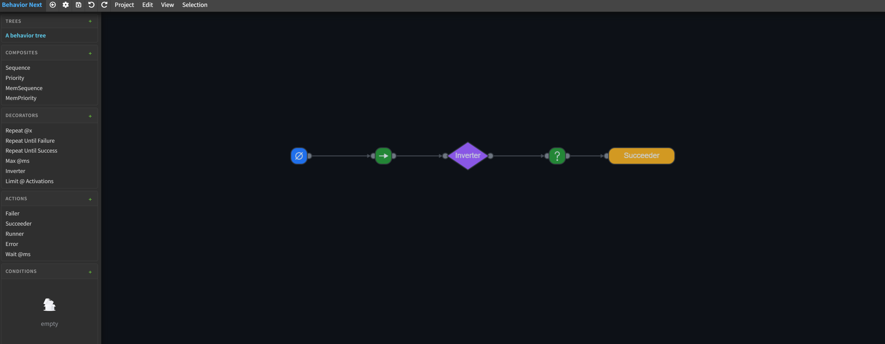

# Behavior Next

**Behavior Next** is a visual behavior tree editor for creating, organizing, importing, and exporting behavior tree projects. It can run as a web app or be packaged as an Electron desktop app for local projects.

## Origin

Behavior Next is built on top of Behavior3 Editor. The original project provided the early behavior tree editor foundation, JSON data model, and part of the canvas runtime experience; the current project has refactored nearly all major components around a new application structure, including the UI, build system, desktop packaging, dependency management, project/settings services, dialogs, notifications, and shortcut system.

## Why Behavior Next?

Behavior Next focuses on visual behavior tree design while keeping an open data format that can integrate with games, robotics, simulations, or other runtime systems.

- **Open Source Software**: under MIT license, you can use this software freely, adapt it to your need and even use a specialized internal version in your company. You can also contribute with bug fixes, suggestions and patches to make it better.

- **Open Format**: Behavior Next can export modeled trees to JSON files, following an open format. If there is no ready-made reader for your preferred language, you can develop your own library and use the trees created here.

- **Behavior Tree Modeling**: the editor supports common behavior tree structures such as composite, decorator, action, and condition nodes.

- **Modern Application Structure**: the UI, build pipeline, desktop packaging, and dependency management have moved to an npm/Vite/Vue/Electron workflow.

- **Minimalist, but Functional**: the interface avoids unnecessary noise and focuses on designing, editing, and managing behavior trees.

- **Customizable**: create your own node types and customize nodes instances individually. Create several projects and trees, change titles and add properties.

- **Does not depends on other tools/editors/engines**.

## Main features

- **Custom Nodes**: you can create your own node types inside one of the four basic categories - *composite*, *decorator*, *action* or *condition*. 
- **Individual Node Properties**: you can modify node titles, description and custom properties.
- **Manual and Auto Organization**: organize by dragging nodes around or just type "a" to auto organize the whole tree.
- **Create and Manage Multiple Trees**: you can create and manage an unlimited number of trees.
- **Import and Export to JSON**: export your project, tree or nodes to JSON format. Import them back. Use JSON on your own custom library or tool. You decide.

## Compatibility

Behavior Next is primarily verified in modern Chromium browsers and Electron. Non-Chromium browsers may differ in canvas dragging, scrollbar styling, or file access behavior. IE is not supported.

## Building

Install dependencies:

    npm install

Run the development server with automatic rebuild and reload:

    npm run dev

This serves the editor at `http://127.0.0.1:8000`.

Build the web assets into `build/`:

    npm run build

Build and package the Electron desktop app into `dist/`:

    npm run dist

## Looking for Behavior Tree Libraries?

- https://github.com/behavior3/behavior3js
- https://github.com/behavior3/behavior3py
